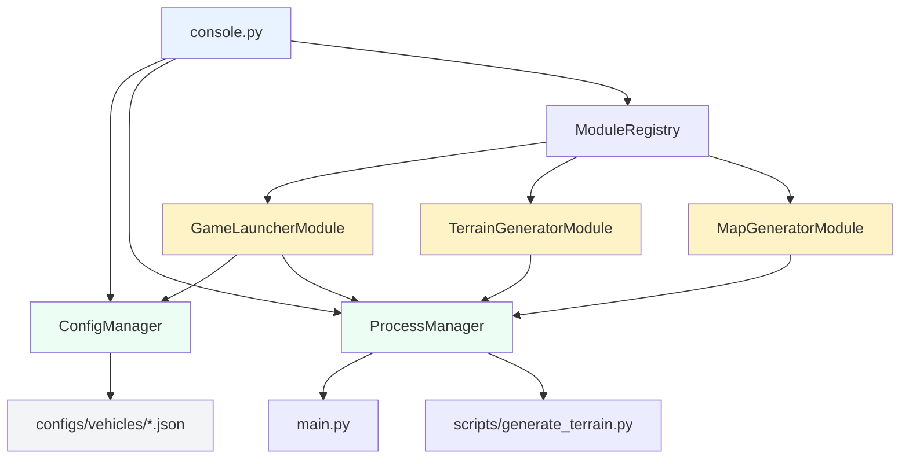

# 📁 项目结构 - Vehicle Game Console

## 完整目录结构

```
vehiclegame/
├── 📄 console.py                    # 控制台入口脚本
├── 📁 tests/                        # 测试脚本
│   └── test_console.py              # 组件测试脚本
├── 📁 docs/                         # 文档目录
│   └── console/                     # 控制台相关文档
│       ├── CONSOLE.md               # 控制台使用文档
│       └── PROJECT_STRUCTURE.md     # 项目结构文档
│
├── 📁 console_modules/              # 控制台功能模块
│   ├── __init__.py
│   ├── base_module.py              # 模块基类 & 注册中心
│   ├── game_launcher.py            # 🚀 游戏启动模块（支持多车辆）
│   ├── terrain_generator.py        # 🛠️ 地形生成模块
│   └── map_generator.py            # 🗺️ 地图生成模块（配置选择/新建/自动保存）
│
├── 📁 core/                        # 核心组件
│   ├── __init__.py
│   ├── config_manager.py           # 配置管理器
│   ├── map_config_manager.py       # 地图配置管理器（configs/maps）
│   └── process_manager.py          # 进程管理器
│
├── 📁 configs/                     # 配置文件目录
│   ├── vehicles/
│   │   ├── sports_car.json        # 跑车配置 (1500kg)
│   │   ├── truck.json             # 卡车配置 (3500kg)
│   │   └── offroad.json           # 越野车配置 (2200kg)
│   ├── maps/                       # 地图配置（自动保存）
│   ├── tracks/                     # 赛道运行时配置（生成输出）
│   └── scenery/                    # 场景元素配置（生成输出）
│
├── 📄 main.py                      # 游戏主入口（现有）
├── 📁 src/                         # 游戏业务代码（现有）
│   ├── business/
│   ├── systems/
│   └── world/
│
├── 📁 scripts/                     # 工具脚本（现有）
│   └── generate_terrain.py
│
├── 📁 res/                         # 资源文件（现有）
│   └── terrain/
│
└── 📄 requirements.txt             # Python 依赖
```

## 核心组件说明

### 1. 控制台入口 (`console.py`)
- 入口与应用主类（Qt / PySide6）

**类**: `ConsoleApp`（位于 `console.py`）
- 初始化 Qt 主窗口与布局
- 注册功能模块
- 管理模块切换
- 异步事件循环
- 日志系统

**主要方法**:
| 方法 | 说明 |
|-----|------|
| `initialize()` | 初始化应用 |
| `run()` | 运行主循环 |
| `switch_module()` | 切换功能模块 |
| `log_message()` | 记录日志 |
| `run_async()` | 运行异步任务 |

### 3. 配置管理器 (`core/config_manager.py`)
**类**: `ConfigManager`
- 加载/保存 JSON 配置
- 管理配置目录
- 创建默认配置

**主要方法**:
| 方法 | 说明 |
|-----|------|
| `load_config(type, name)` | 加载配置 |
| `save_config(type, name, config)` | 保存配置 |
| `list_configs(type)` | 列出配置 |
| `delete_config(type, name)` | 删除配置 |

### 4. 进程管理器 (`core/process_manager.py`)
**类**: `ProcessManager`
- 异步执行子进程
- 实时输出回调
- 超时控制
- 进程终止

**主要方法**:
| 方法 | 说明 |
|-----|------|
| `run_command(id, cmd, callback, timeout)` | 运行命令 |
| `kill_process(id)` | 终止进程 |
| `get_result(id)` | 获取结果 |

### 5. 模块基类 (`console_modules/base_module.py`)
**类**: `ConsoleModule` (抽象基类)
- 定义模块接口
- 提供通用功能

**类**: `ModuleRegistry`
- 模块注册中心
- 动态创建模块实例

### 6. 游戏启动模块 (`console_modules/game_launcher.py`)
**类**: `GameLauncherModule`
- 多车辆配置选择
- 地图配置选择（`configs/maps/*.json`）
- 游戏设置
- 启动/停止控制

**特性**:
- ✅ 支持 3 种预设车辆（跑车/卡车/越野车）
- ✅ 实时显示车辆信息
- ✅ 异步启动游戏进程
- ✅ 日志输出

### 7. 地形生成模块 (`console_modules/terrain_generator.py`)
**类**: `TerrainGeneratorModule`
- 可视化参数配置
- 轨道走廊选项
- 实时进度显示
- 日志输出

**参数**:
- 基本参数：尺寸、种子、噪声
- 高级参数：八度音、持久性
- 轨道参数：CSV 文件、走廊宽度

## 配置文件格式

### 车辆配置示例 (`configs/vehicles/sports_car.json`)

```json
{
  "name": "Sports Car",
  "vehicle_mass": 1500.0,
  "position": [0, 0, 12.0],
  "heading": 0,
  "physics": {
    "max_speed": 200.0,
    "acceleration": 80.0,
    "drag_coefficient": 0.3
  },
  "suspension": {...},
  "transmission": {...},
  "pose": {...},
  "wheels": [...]
}
```

### 关键参数说明

| 参数路径 | 说明 | 影响 |
|---------|------|------|
| `vehicle_mass` | 车辆总质量 | 加速/刹车/悬挂 |
| `physics.max_speed` | 最高速度 | 速度上限 |
| `physics.acceleration` | 加速度 | 加速性能 |
| `suspension.wheels` | 悬挂配置 | 行驶稳定性 |
| `transmission.gear_ratios` | 档位速比 | 加速曲线 |

## 依赖关系图



## 使用流程

### 启动控制台
```bash
python console.py
```

### 启动游戏
1. 选择车辆配置（sports_car/truck/offroad）
2. 选择地形配置
3. 点击"启动游戏"

### 生成地形
1. 设置地形参数
2. （可选）配置轨道走廊
3. 点击"生成地形"
4. 查看输出到 `res/terrain/`

## 扩展指南

### 添加新模块

1. 创建模块文件:
```python
# console_modules/my_module.py
from PySide6 import QtWidgets
from console_modules.base_module import ConsoleModule

class MyModule(ConsoleModule):
    name = "my_module"
    display_name = "🔧 我的模块"
    
    def build_ui(self, parent):
        label = QtWidgets.QLabel("我的功能")
        parent.addWidget(label)
```

2. 在 `console.py` 中导入:
```python
from console_modules.my_module import MyModule
```

3. 在 `_register_modules()` 中注册:
```python
self.modules["my_module"] = MyModule(self)
```

### 添加新车辆配置

1. 复制现有配置:
```bash
cp configs/vehicles/sports_car.json configs/vehicles/my_car.json
```

2. 编辑 JSON 文件修改参数

3. 在控制台中选择新配置

## 测试

### 运行组件测试
```bash
python tests/test_console.py
```

### 测试项目
- ✅ 配置管理器
- ✅ 模块注册中心
- ✅ 进程管理器
- ✅ 模块导入

## 技术栈

| 组件 | 技术 |
|-----|------|
| GUI 框架 | PySide6 (Qt) |
| 配置格式 | JSON |
| 进程管理 | asyncio + subprocess |
| 日志系统 | 内置 + 自定义 |

## 版本历史

### v0.1.0 (2025-02-25)
- ✨ 初始版本
- 🚀 游戏启动模块（支持 3 种车辆）
- 🛠️ 地形生成模块
- ⚙️ 配置管理系统
- 📊 可视化界面

---

**维护者**: Vehicle Game Team  
**许可证**: MIT
